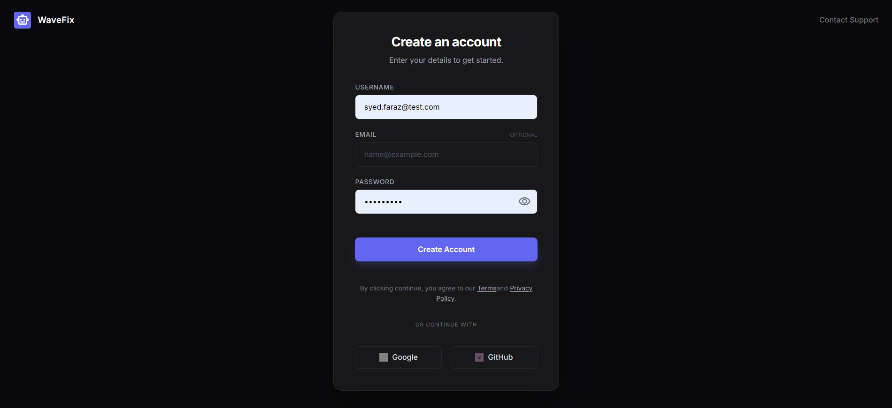
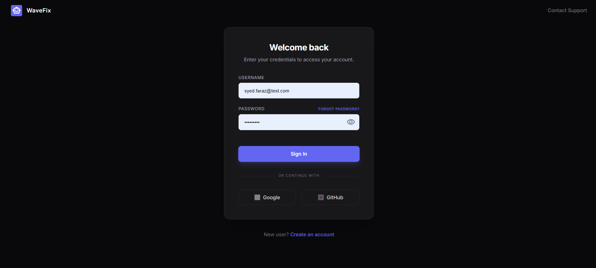
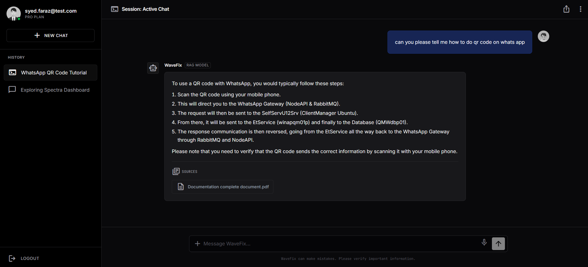

# WaveFix - AI Tech Support Agent

WaveFix is a full-stack Retrieval-Augmented Generation (RAG) application designed to provide automated technical support. It uses advanced LLMs to answer user queries based on a knowledge base of uploaded documents (PDFs).

## App Screenshots

### Sign Up


### Sign In


### Chat Interface


## Key Features

*   **RAG Architecture**: Retrieve and answer questions from local PDF documentation.
*   **Modern Frontend**: Built with **React**, **Vite**, and **Tailwind CSS** for a responsive and premium UI.
*   **Robust Backend**: Powered by **FastAPI** and **LangChain**.
*   **Dynamic Chat**: Auto-generates chat session titles based on context.
*   **Secure Auth**: User signup and login functionality with JWT.
*   **Persistance**: SQLite database for storing chat history and user data.

## Tech Stack

*   **Frontend**: React.js, Tailwind CSS V4, Lucide React (Icons).
*   **Backend**: Python 3.12+, FastAPI, SQLAlchemy.
*   **AI/ML**: LangChain, OpenAI GPT-4 (Configurable), FAISS (Vector Store).

## Prerequisites

*   Python 3.10+
*   Node.js 18+
*   OpenAI API Key

## Quick Start

### 1. Backend Setup

Navigate to the `BackEnd` directory:

```bash
cd BackEnd
```

Create a virtual environment and install dependencies:

```bash
# Windows
python -m venv .venv
.\.venv\Scripts\activate

# Install packages
pip install -r requirements.txt
```

Create a `.env` file in the `BackEnd` folder:

```ini
OPENAI_API_KEY=your_openai_api_key_here
DATABASE_URL=sqlite:///./chat_app.db
```

Start the Backend Server:

```bash
uvicorn app.main:app --reload
```
*Server runs at `http://localhost:8000`*

### 2. Frontend Setup

Open a new terminal and navigate to the `FrontEnd` directory:

```bash
cd FrontEnd
```

Install dependencies:

```bash
npm install
```

Start the Development Server:

```bash
npm run dev
```
*App runs at `http://localhost:5173`*

## Knowledge Base

Place your PDF documents in `BackEnd/documents/`. The system auto-loads and recursively chunks them for the RAG retriever upon startup.
